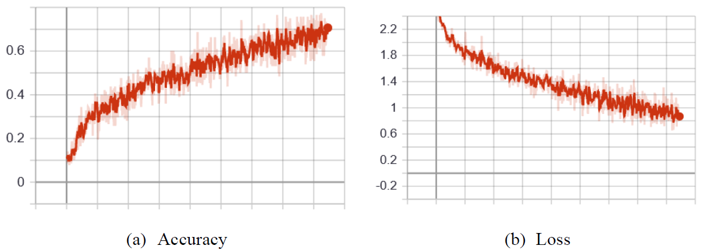

# AlexNet_TF

 A TensorFlow implementation of AlexNet to classify the CIFAR-10 dataset.

This is the lab 4 of the course <人工智能加速器> in BUAA, China.

### Requirements

Tensorflow 1.15

Maybe the lower version also works fine :)

### How to use?

1. `git clone https://github.com/Li-Jinjie/AlexNet_TF.git`

2. Download the *CIFAR-10 python version* dataset from [here](https://www.cs.toronto.edu/~kriz/cifar.html) and unzip it to the path `./AlexNet_TF/data/cifar-10-batches-py`

3. Install some python packages: `pip install -r requirements.txt`

4. To train the model, please run **tf_train_model.py** : `python tf_train_model.py `. After training, the .pb model will be saved in the path */model/*.

5. To test the model, please run **tf_test_model.py** : `python tf_test_model.py`.

6. To use tensorboard, please run `tensorboard --logdir=./logs` in the **terminal** and open the URL in your web browser.

   ---

7. If you want to use all 50000 data for training, please uncomment the code in cifar-10.py (44-57 lines).

8. If you want to save the ckpt model, please uncomment the code in **tf_train_model.py** (96-97 lines).

9. If you want to continue training from a ckpt model, please comment line 39 and uncomment line 41 in **tf_train_model.py**. You also need to make sure the path in line 41 is correct.

10. If you want to freeze the model for model converting, please uncomment the code in **tf_train_model.py** (101-106 lines)

### My parameters for training

Stage 1:

| Training Set | Validation Set | Test Set | Learning_rate | Batchsz | Epoch |
| :----------: | :------------: | :------: | :-----------: | :-----: | :---: |
|    18000     |      2000      |  10000   |     0.001     |   128   |  30   |

Stage 2:

| Training Set | Validation Set | Test Set | Learning_rate | Batchsz | Epoch |
| :----------: | :------------: | :------: | :-----------: | :-----: | :---: |
|    45000     |      5000      |  10000   |     0.001     |   128   |  20   |

Stage 3:

| Training Set | Validation Set | Test Set | Learning_rate | Batchsz | Epoch |
| :----------: | :------------: | :------: | :-----------: | :-----: | :---: |
|    45000     |      5000      |  10000   |    0.0001     |   128   |  20   |

Finally the test accuracy is about 0.675.

